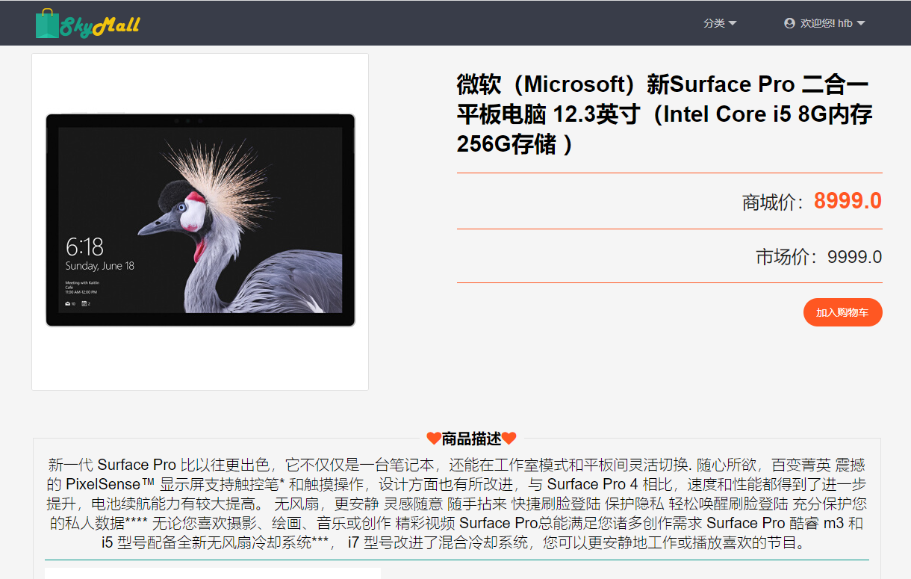
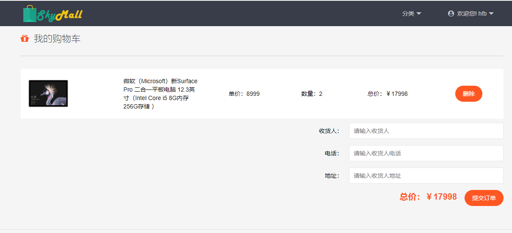
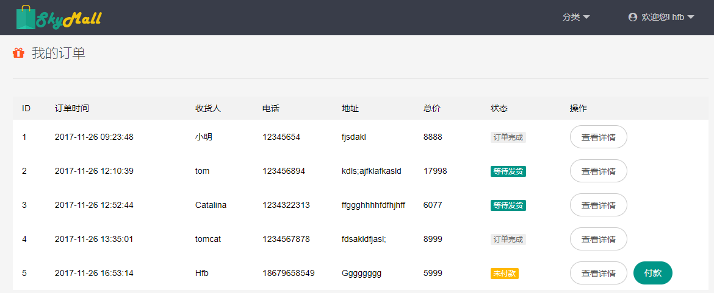
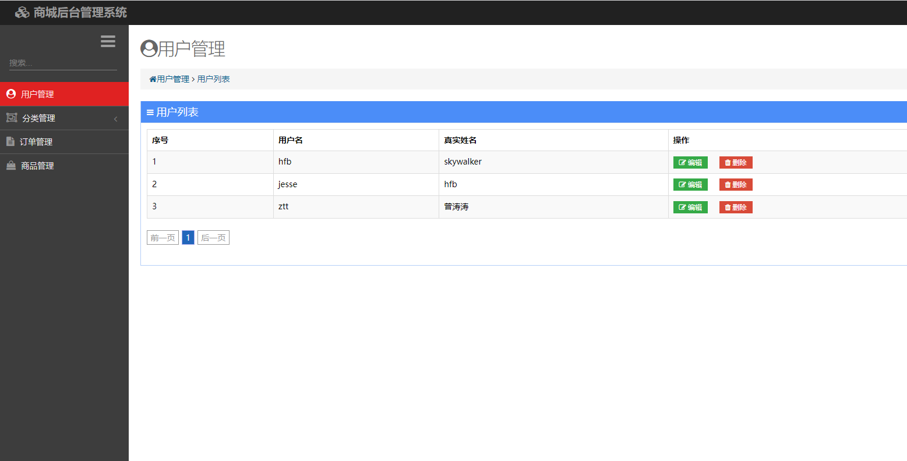
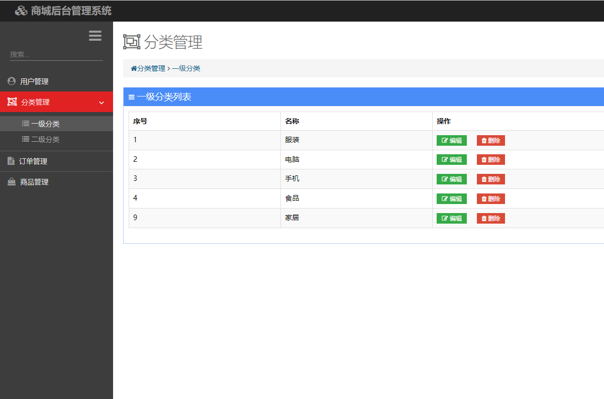
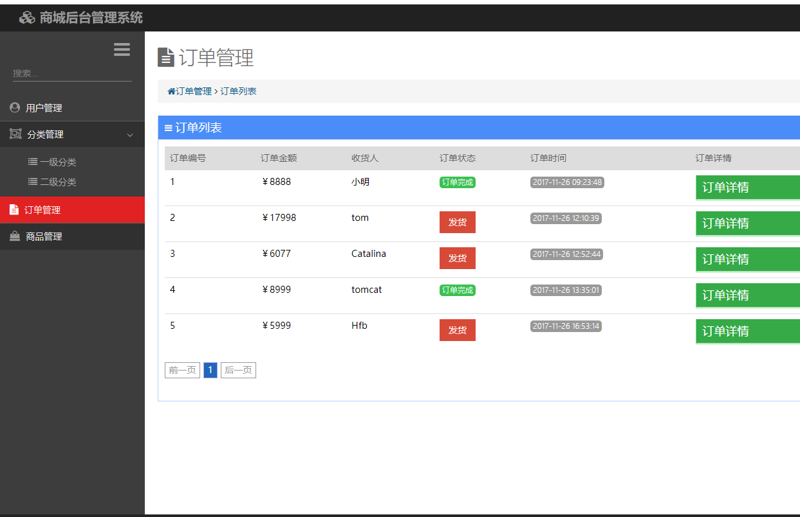
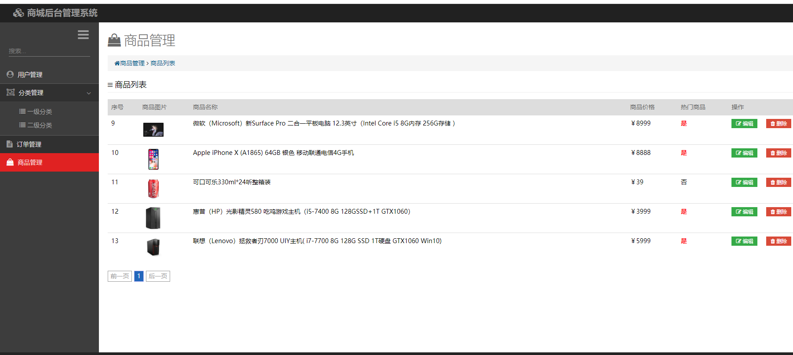

### 作者QQ：1556708905(支持修改、 部署调试、 支持代做毕设)

#### 支持代做任何毕设论、接网站建设、小程序、H5、APP、各种系统等

**毕业设计所有选题地址 [https://github.com/zhengjianzhong0107/allProject](https://github.com/zhengjianzhong0107/allProject)**

**博客地址：[https://blog.csdn.net/2303_76227485/article/details/128650433](https://blog.csdn.net/2303_76227485/article/details/128650433)**

**视频演示：[https://space.bilibili.com/384537280](https://space.bilibili.com/384537280)**


# SpringBoot网上商城(源代码+数据库+12000字文档)013

## 一、系统介绍

前台功能
商品分类查询，加入购物车，提交订单，查看订单

后台功能：
用户管理，订单管理，分类管理，商品管理

## 二、所用技术

后端技术栈：

- springboot
- jpa
- mysql

前端技术栈：

- thymeleaf


## 三、环境介绍

基础环境 :IDEA/eclipse, JDK 1.8, Mysql5.7及以上,Maven

源码+数据库脚本

所有项目以及源代码本人均调试运行无问题 可支持远程调试运行


## 四、页面截图
















## 五、浏览地址

项目地址：
前台访问：http://127.0.0.1:8081/mall

用户名： hfb   密码：123456

后台访问：http://localhost:8081/mall/admin/toLogin.html

用户名： admin   密码：admin


## Docker镜像

### Pull image

```bash
docker pull skywa1ker/mall:latest
```

### Run

```bash
docker run -p 8081:8081 --name mall -v /data/mall/config:/data/mall/config -v /data/mall/log:/data/mall/log --restart=always -d skywa1ker/mall:latest
```


